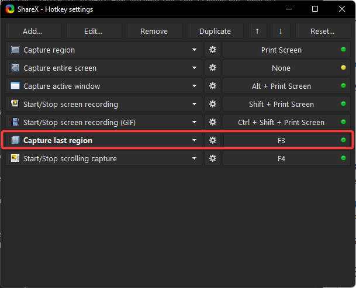
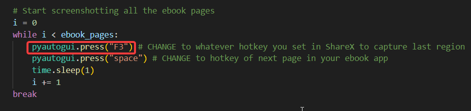

# Ebook to PDF Converter
#### Video Demo: <https://youtu.be/ui5L4dlW5Pg>
#### Description:
This program automates the process of converting an ebook from a restricted ebook application into a single PDF file using Python. It takes screenshots of each page of the ebook, enhances the image quality, and compiles them into a PDF. This is particularly useful for ebooks that cannot be directly downloaded or exported. The need for this program arose from the desire for better annotation features, which are often more robust in PDF readers compared to ebook applications.

## Features
- Automated Screenshotting: The program uses PyAutoGUI to automate the process of taking screenshots of each page in the ebook.
- Image Enhancement: Each screenshot is enhanced using OpenCV to ensure the highest possible quality in the resulting PDF.
- PDF Compilation: The program compiles all the enhanced images into a single PDF file using the img2pdf package.
- Cross-Platform Support: The program includes functionality to open the resulting PDF on different operating systems (Windows, MacOS, and Linux).

## Prerequisites
Before running this program, ensure you have the following software installed:

1.ShareX: A powerful tool to handle the screenshotting process. You can download it from [here](https://getsharex.com/).

2.Python: Make sure Python is installed on your system. You can download it from [python.org](https://www.python.org/downloads/).

## Installing Python Packages
You need to install the following Python packages before running this code.

1.OpenCV-python

```bash
$ pip install opencv-python
```

2.img2pdf

```bash
$ pip install img2pdf
```
This package enables you to append all the images and convert them into a PDF.

3.PyAutoGUI

```bash
$ pip install PyAutoGUI
```
This package allows you to simulate keyboard presses, which is useful for automating the screenshot process.

4.Numpy

```bash
$ pip install numpy
```
This package is used for numerical operations and is required for image processing.

## Other Packages
Below are Python packages used in the code that do not require separate installation as they are included in the standard Python library:

- os: To interact with the operating system.
- re: Regular expressions for validating directory paths and file names.
- sys: For system exit functionality.
- time: To calculate the time taken from the start to the end of the program.
- platform: To determine the user's operating system.
- subprocess: To open the PDF file on MacOS and Linux.

## How to Use
1.Set Up ShareX: Configure ShareX to capture screenshots using a specific hotkey. Ensure the hotkey matches the one set in the code (in my case I set it to "F3").



If you have a different hotkey, make sure to change it appropriately within the code:



2.Run the Program: Execute the Python script. You will be prompted to enter:

- The directory where the screenshots will be saved.
- The name of the resulting ebook PDF file.
- The number of pages in the ebook.

3.Switch to Ebook Application: Once you confirm readiness, the program will give you a few seconds to switch to your ebook application.

4.Automated Screenshotting: The program will take screenshots of each page, enhance them, and compile them into a PDF.

5.View the PDF: After the PDF is created, the program will automatically open it for you to review.

## Example Usage
Here is a sample session to guide you through the usage of the program:

1.Directory Path: 'D:\Ebooks\Screenshots'

2.Ebook Name: 'MyEbook'

3.Number of Pages: 150

The program will take screenshots, enhance each image, and save them as 'MyEbook.pdf' in the specified directory.

## Code Explanation

```bash
import os
import re
import cv2
import sys
import time
import img2pdf
import pyautogui
import numpy as np
import platform
import subprocess

def main():
    # Main function to drive the program
    ...

def get_dir():
    # Prompt user for directory path
    ...

def valid_dir(image_dir):
    # Validate the provided directory path
    ...

def get_ebook_name():
    # Prompt user for the ebook name
    ...

def valid_ebook_name(ebook_name):
    # Validate the ebook name
    ...

def screenshot_ebook():
    # Automate the process of taking screenshots of the ebook
    ...

def valid_ebook_pages(ebook_pages):
    # Validate the number of pages
    ...

def confirm_readiness():
    # Confirm if user is ready to start screenshotting
    ...

def sharpen_image(image_path):
    # Enhance image quality using OpenCV
    ...

def convert_images_to_pdf(image_dir, output_pdf):
    # Convert the enhanced images to a single PDF
    ...

def open_pdf(file_path):
    # Open the resulting PDF file
    ...

if __name__ == "__main__":
    main()
```


This script automates the entire process of converting an ebook to a PDF, making it easy for users to create high-quality, annotated PDFs from their ebook collections. Enjoy seamless ebook conversion and enhance your reading experience with better annotation capabilities in PDFs!
